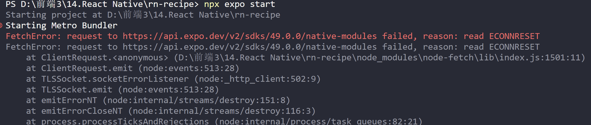
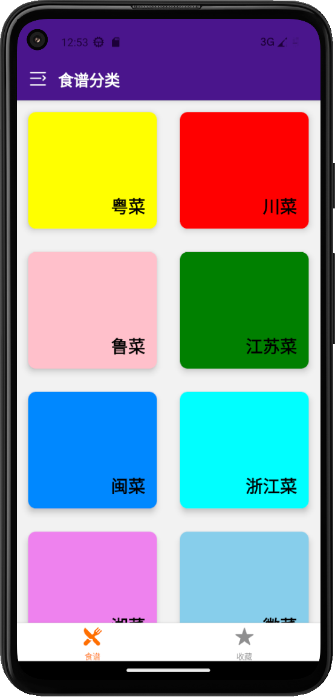
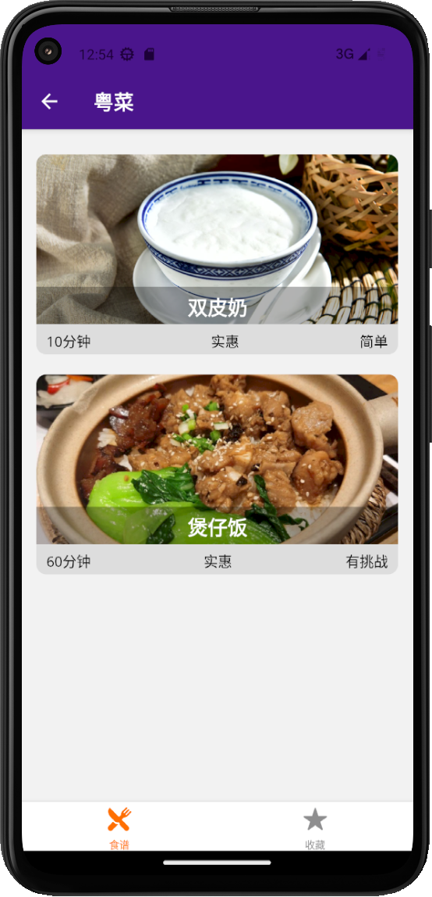
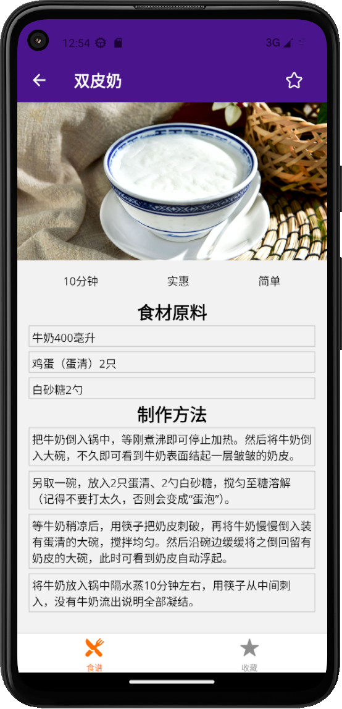
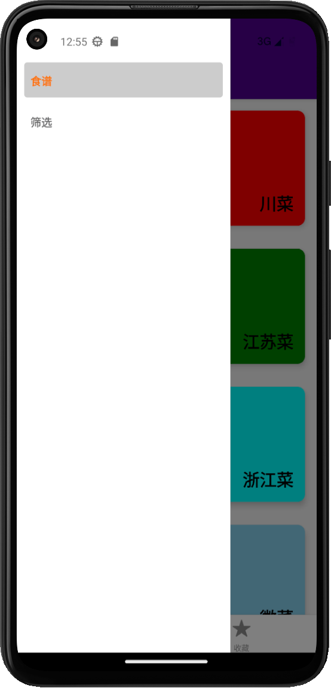
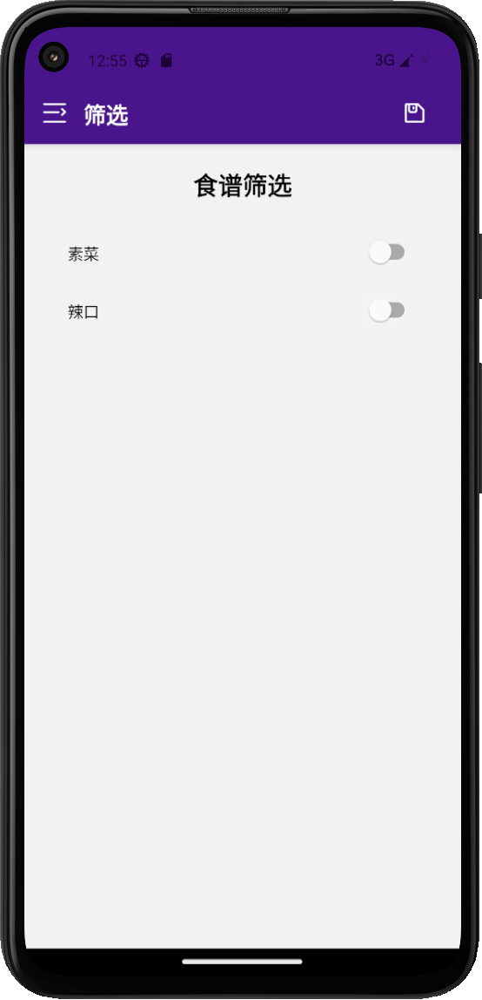
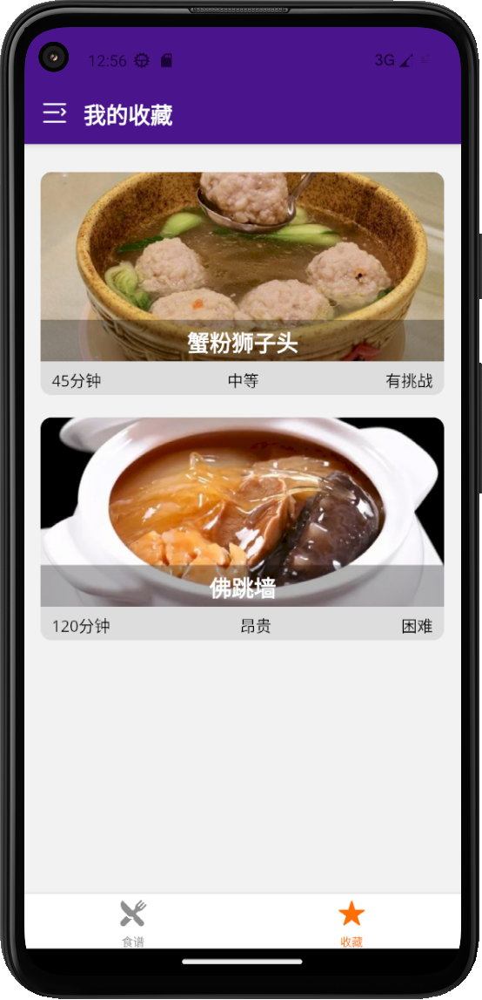
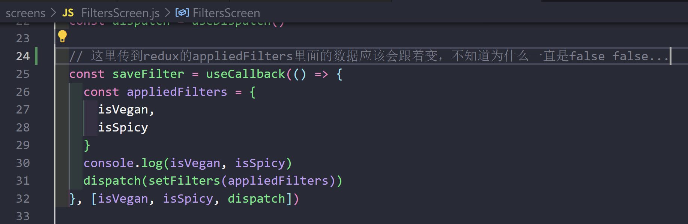
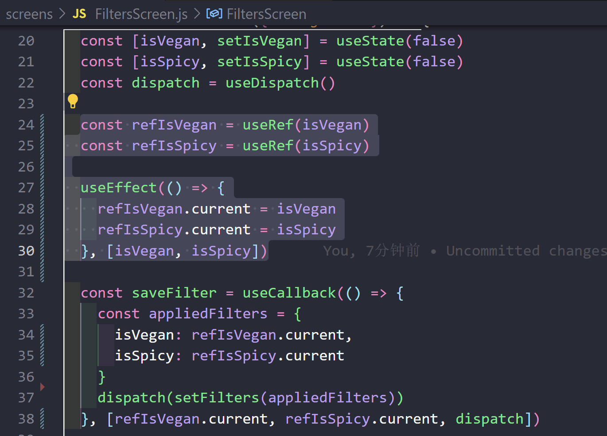
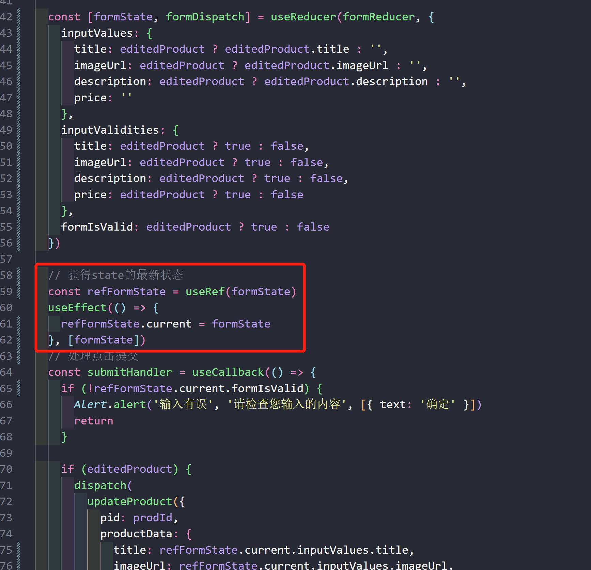

【纯前端项目】

hybrid app，可在安卓/IOS 上运行

### 项目启动

1.输入“npm i”安装依赖包

2.输入“npx expo start”启动（有时会因为网络原因出现 Fetch 错误，如下图）

### 演示效果

<table>
    <tr>
        <td></td>
        <td></td>
        <td></td>
    </tr>
    <tr>
        <td></td>
        <td></td>
        <td></td>
    </tr>
</table>

### 遗留问题（已解决）

过滤器的 isVegan 和 isSpicy 都能随着 switch 的状态而改变，就是不明白为什么一到了 saveFilter 里面他们的值一直都是 false

求大佬指点 ε(┬┬﹏┬┬)3

#### 解决方法

在useEffect中监听state变化，存进ref中（如下图）

#### 具体原因

useState的值在每个rernder中都是独立存在的，而useRef.current则更像是相对于render函数的一个全局变量，每次他会保持render的最新状态。（useState异步更新其值，useRef同步更新）

在类组件中，`setState` 会调用类中的 render 函数，state 对象只是其中的属性发生改变，其对象地址并未改变，因为 state 数据更新是一个异步操作(微任务)，所以无法**同步的**获取到最新的 `state`。解决方法是利用 `setTimeout` 的宏任务特性，则可以在其回调函数中获取到最新的 `state`，这是可行的。

在函数组件中，`setState` 后，React 重新调用整个 Index 函数，构建新的 Fiber 树。`setTimeout`虽然是在 `setState` 后调用的，但是还是在第一次的 Index 函数中，此时的 `state` 还是旧的数据。

#### 拓展

其实useReducer也有同样的问题...（在reducer函数中的return类似于调用`setState`，拿不到最新的`state`）

解决方法同样是：在useEffect中监听state变化，存进ref中

非常感谢这两篇文章：

[react useState数据更新不同步问题_react usestate不更新_one.dream的博客-CSDN博客](https://blog.csdn.net/qq_44472722/article/details/123635539)

[react 的 useState 到底该怎么获取最新值？？？ - 掘金 (juejin.cn)](https://juejin.cn/post/7233720373237776444)
